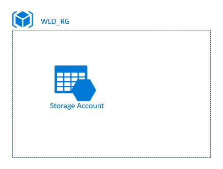

# **Azure Storage Account**

[](https://dev.azure.com/SantanderCCoE/CCoE/_apis/build/status/Products/iac.az.modules.storage-account-basic?branchName=master)

## Overview


### Acronym
Acronym for the product is **sta**, check [List of Acronyms](https://confluence.ci.gsnet.corp/display/OPTIMUM/List%2Bof%2BAcronyms) for a complete list of acronyms

### Description
An Azure storage account contains all of your Azure Storage data objects: blobs, files, queues, tables, and disks. The storage account provides a unique namespace for your Azure Storage data that is accessible from anywhere in the world over HTTP or HTTPS. Data in your Azure storage account is durable and highly available, secure, and massively scalable.

|Configuration|Description|
|:--|:--|
|Supported Services|Blob, Queue|
|Supported Protocols|HTTPS|
|Authentication|Azure AD RBAC model should be used to access resources, **access using SAS Tokens should not be used** (<span style="background-color: #FFFF00">not enforced</span>)|

### Configuration
The product supports the [common configuration parameters](https://confluence.ci.gsnet.corp/display/OPTIMUM/Product+Parameters#ProductParameters-Common) for all certified products.
<span style="background-color: #FFAA00">OJO QUE AQUI APARECEN PARA STA VARIABLES QUE PARA BASIC NO APLICAN -->RAFA!!! </span>

Additionally the product supports the following custom configuration:

|Parameter| Tf Name | Default Value | Type |Mandatory |Others |
|:--|:--:|:--:|:--:|:--:|:--|
|storage Tier| storage_tier| n/a | string| yes| Standard/Premium |
|Replication Type| storage_replication | n/a | string | yes| LRS/GRS/RAGS... |

### Public Documentation
[Azure Storage Account Overview](https://docs.microsoft.com/en-us/azure/storage/common/storage-account-overview)

### Version
|Version|Target SCF|
|:--|:--|
|1.0.0|<span style="background-color: #FFAA00">SM</span>|

### Dependencies
The following resources must exist before the deployment can take place:

Resources given by the Cloud Competence Center that need to be in place:
- [ ] Azure Subscription
- [ ] Resource Group
- [ ] Azure Active Directory Tenant
- [ ] A deployment Service Principal with owner permissions on the resource group


### Target Audience
|Audience |Purpose  |
|--|--|
| Cloud Center of Excellence | Understand the Design of this Service |
| Cybersecurity Hub | Understand how the Security Framework is implemented in this Service and who is responsible of each control |
| Service Management Hub | Understand how the Service can be managed according to the Service Management Framework |

## Usage

Include the next code into your main.tf file:

```hcl
module "sta" {
  source = "<storage.account-basic module source>"

  <Storage Account Basic configuration parameters>
}
```

## Architecture


## Networking

### Network topology


### Exposed product endpoints
The following endpoints can be used to consume or manage the Certified Product:

#### Management endpoints (Control Plane)
These endpoints will allow to make changes in the configuration of the Certified Service, change permissions or make application deployments.

|EndPoint|IP/URL  |Protocol|Port|Authorization|
|:-|:-|--|--|:-|
|Azure Resource Management REST API|https://management.azure.com/|HTTPS|443|Azure Active Directory|


#### Consumption endpoints (Data Plane)
These endpoints will allow you to consume the Certified Service from an application perspective.

|EndPoint|IP/URL  |Protocol|Port|Authorization|
|:-|:-|--|--|:-|
|Secured public endpoint, configured with a custom name|https://[storage account name].[service].core.windows.net|HTTPS|443|Authentication and Authorization via Azure AD RBAC model|


# **Security Framework**
This section explains how the different aspects to have into account in order to meet the Security Control Framework for this Certified Service. 

This product has been certified for the [Security Control Framework v1.2](https://teams.microsoft.com/l/file/E7EFF375-EEFB-4526-A878-3C17A220F63C?tenantId=72f988bf-86f1-41af-91ab-2d7cd011db47&fileType=docx&objectUrl=https%3A%2F%2Fmicrosofteur.sharepoint.com%2Fteams%2FOptimum-SanatanderAzureFoundationsProject%2FShared%20Documents%2FCCoE-Channel%2FSecurity%20Control%20Framework%2FSantander%20-%20CCoE%20-%20Security%20Control%20Framework%20-%20v1.2.docx&baseUrl=https%3A%2F%2Fmicrosofteur.sharepoint.com%2Fteams%2FOptimum-SanatanderAzureFoundationsProject&serviceName=teams&threadId=19:e20a3726dc824141b32579df437f7a66@thread.skype&groupId=26385c5b-85e4-4376-988a-27ed549d9419) revision.

## Security Controls based on Security Control Framework

### Foundation (**F**) Controls for Rated Workloads
|SF#|What|How it is implemented in the Product|Who|
|--|:---|:---|:--|
|SF1|Resource Tagging on all resources|Product includes all required tags in the deployment template|CCoE|
|SF2|IAM on all accounts|CCoE RBAC model for products certifies right level of access to the storage account. Only Azure AD RBAC access is enabled for the product (SAS Tokens are not used <span style="background-color: #FFFF00">although this is not enforced</span>)|CCoE|
|SF3|MFA on accounts|This is governed by Azure AD|Protect|
|SF4|Platform Activity Logs & Security Monitoring|<span style="background-color: #FFAA00">Platform logs and security monitoring provided by Platform</span>|CCoE|
|<span style="color:red">SF5</span>|Virus/Malware Protection|<span style="background-color: #FFFF00">No antivirus protection for Storage Account</span>||
|SF6|Authenticate all connections|Azure Storage Account uses trusted certificates|MS|


### Medium (**M**) Controls for Rated Workloads
|SM#|What|How it is implemented in the Product|Who|
|--|:---|:---|:--|
|SM1|Encrypt data at rest using application or server level encryption|[Default Azure Storage Encryption is enabled to encrypt data at rest](https://docs.microsoft.com/en-us/azure/storage/common/storage-service-encryption)|CCoE|
|SM2|Encrypt data in transit using private & public interconnections|<span style="background-color: #FFAA00">Certified Product enables only https traffic</span>|CCoE|
|SM3|Control resource geography|Certified Product location can be configured using product deployment parameters|DevOps|

### Application (**P**) Controls for Rated Workloads
|SP#|What|How it is implemented in the Product|Who|
|--|:---|:---|:--|
|SP1|Segregation of Duties|[It is possible to use a built-in role in case there is a specific need of delegating that role to some specific administrator with the least privileges required](https://docs.microsoft.com/en-us/azure/storage/common/storage-auth-aad?toc=%2fazure%2fstorage%2fblobs%2ftoc.json)|DevOps|
|SP2|Vulnerability Management|Detect is responsible for vulnerability scanning of public endpoints|Detect|
|SP3|Security Configuration & Patch Management|Since this is a **SaaS** service, product upgrade and patching is done by CSP|MS|
|<span style="color:red">SP4</span>|Service Logs & Security Monitoring|<span style="background-color: #FFAA00">Product is not connected to Log Analytics for activity and security monitoring.</span>.|CCoE|
|SP5|Privileged Access Management|**Data Plane**: Access to data plane is not considered Privileged Access<br>**Control Plane**:Access to the control plane is considered Privileged Access and is governed as per the [Azure Management Endpoint Privileged Access Management]() policy|n/a|
|SP6|Network Security Perimeter|**SP6.1**: DevOps can configure the isolated network by leveraging the product built in Virtual Firewall<br>**SP6.2**: Virtual Firewall can be used to deny incoming traffic, built in Azure DDoS protection for PaaS/SaaS services<br>**SP6.3**: Doesn't apply as no outbound traffic is generated from the service<br>**SP6.4,SP6.5**: Virtual Network Service Endpoint can be configured to enable incoming traffic from on-prem or private Virtual Networks. Public IP filtering is set to prevent access from Internet<br>**SP6.6**: Doesn't apply<br>**SP6.7**: : Doesn't apply<br>**SP6.8**: : Doesn't apply<br>|DevOps, CCoE|
|<span style="color:red">SP7</span>|Advanced Malware Protection|[<span style="background-color: #FFFF00">Advanced Threat Protection can be enabled at the Storage Account to mitigate this thread (**Only for the Blob service**) ](https://docs.microsoft.com/en-us/azure/storage/common/storage-advanced-threat-protection)|<span style="background-color: #FFFF00"> DevOps</span>|
|SP8|Cyber incidents management & Digital evidences gathering|Isolate infrastructure product is possible with Virtual Firewall|DevOps|
|SP9|Pentesting|All penetration testing must be authorized by business owners and pertinent stakeholders|Cybersecurity, DevOps|

# **Service Management Framework**
This section explains how the different aspects to have into account in order to meet the Service Management Framework for this Certified Service. 

This product has been certified for the [Service Management Framework v1.0]() revision
## Service Management Controls based on Service Management Control Framework

### Foundation (**F**) Controls for Rated Workloads
|MF#|What|How it is implemented in the Product|Who|
|--|:---|:---|:--|
|<span style="color:red">MF03</span>|Service Terms and Condition for Certified Services are up to date and agreed by consumers|<span style="color:red">Missing CCoE Certified Products Terms & Conditions</span>|CCoE|
|MF05|Cloud resources are properly tagged accordingly to the policy defined (for cost, environment, business service, etc.)|Product implements the required tagging policy as per [Product Tagging](https://dev.azure.com/SantanderCCoE/CCoE/_wiki/wikis/CCoE.wiki?pagePath=%2FWay%20of%20Working%2FProducts%2FProduct%20Tagging&pageId=62&wikiVersion=GBwikiMaster)|CCoE|
|MF06|When deprovisioning Certified Services ensure that all dependencies are also deleted (i.e. no left-over AD items and firewall rules)|Removal of a product eliminates all dependencies|CCoE|
|MF07|A Knowledge Management environment (Wiki, Confluence, etc.) is implemented to capture Certified Services (products) documentation and support knowledge transfer|Product Readme document includes all required information|CCoE|
|MF11|Certified Services are automatically provisioned and deprovisioned, and change requests are available through automation|Certified Products should be deployed using automation pipelines|CCoE/DevOps|
|MF12|Certified Services SLAs are defined and aligned with the Cloud platform SLAs|Product implements Azure SLAs as per [Azure Storage SLAs](https://azure.microsoft.com/en-au/support/legal/sla/storage/v1_4/)|MS|

### Standard (**S**) Controls for Rated Workloads
|MS#|What|How it is implemented in the Product|Who|
|--|:---|:---|:--|
|<span style="color:red">MS01</span>|Certified Services are monitored, and alerts are automatically generated, correlated and managed based on the policies defined|||
|MS02|High Availability and Disaster Recovery scenarios are defined and tested following a defined schedule|<ul><li>Azure Storage Account is certified with geo-redundancy to support high availability</li><li>No support for Disaster Recovery for accidental remove scenarios</li></ul>|CCoE|

### PaaS (**P**) Controls for Rated Workloads
|MP#|What|How it is implemented in the Product|Who|
|--|:---|:---|:--|
|MP01|IAM controls are applied and managed for service access|IAM is enabled at the Certified Service via automated deployment pipelines|CCoE|

#**Exit Plan**

AzCopy is a command-line utility that you can use to copy blobs or files to or from a storage account. 
* [Get started with AZ Copy](https://docs.microsoft.com/en-us/azure/storage/common/storage-use-azcopy-v10)
* Please, review the section **Download Files** at [Transfer data with AzCopy and file storage](
https://docs.microsoft.com/en-us/azure/storage/common/storage-use-azcopy-files)

#**Product Artifacts**

This section explain the structure and elements that represent the artifacts of product.

|Folder|Name|Description
|--|:-|--|
|documentation|network_diagram.png|Network topology diagram|
|documentation|architecture_diagram.png|Architecture diagram|
|Root|Readme.md|Product documentation file|
|Root|main.tf|Terraform file to use in pipeline to build and release a product|
|Root|variables.tf|Terraform file to use in pipeline to configure product|


# **Links to internal documentation**

**Reference documents** :  
- [List of Acronyms](https://confluence.ci.gsnet.corp/display/OPTIMUM/List%2Bof%2BAcronyms)
- [Naming Convention for Repos](https://confluence.ci.gsnet.corp/display/OPTIMUM/Naming+Convention+for+Azure+resources)
- [Repo module strategy for terraform](https://confluence.ci.gsnet.corp/display/OPTIMUM/Repo+module+strategy+for+Terraform)
- [Product Portfolio](https://confluence.ci.gsnet.corp/display/OPTIMUM/CCoE+Product+Portfolio)
- [Naming Convention for Azure Resources](https://confluence.ci.gsnet.corp/display/OPTIMUM/Naming+Convention+for+Azure+resources)